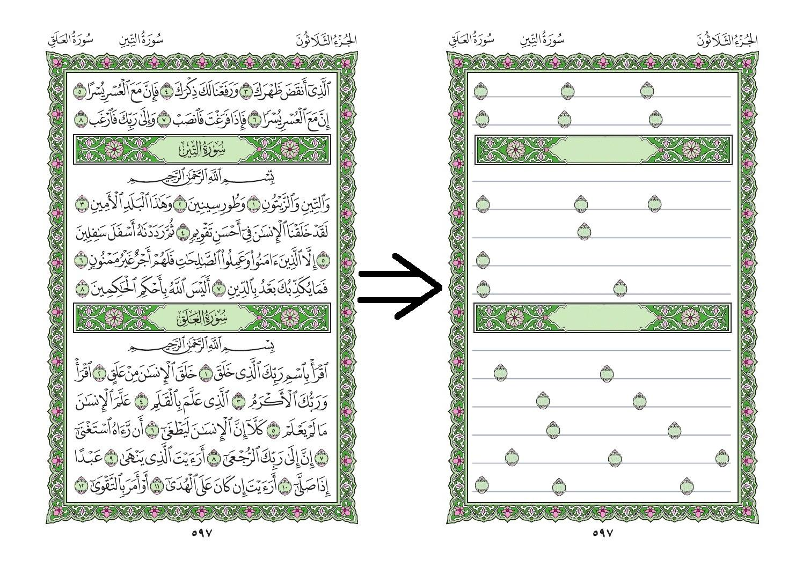

# Tahfiz_mushaf

a quick script to convert [Mushaf AlMadinah](data/Mushaf.pdf "Mushaf AlMadinah") to a notebook for Hifz.
the script is not written to be generic with any mushaf, but to accomplish a one-off task. so there is no warranties for using that script.

sample:

## How it works

- loop on the pdf file extracting the image representing every page
- paste a 15-line page template on each mushaf page
- detect locations of `ayat separator`(s)
- paste a no-text version of `ayat separator` on the page
- detect locations of `soura separator`(s)
- paste a no-text version of `soura separator` on the page
- collect all pages in one output pdf file

## Todo

- performance optimization
  - minimize the conversion of image format
  - reduce output file size

## usage

- python `converter.py` path/to/the/pdf/file

## download

- [output_hefz_v1.0.pdf](data/output_Mushaf.pdf "v2.0 pdf file")
